# Projet Fil Rouge – Module 183

## Implémenter la sécurité d'une application

**Durée :** Sur toute la durée du module  
**Modalités :** Travail individuel  
**Sujet :** Développement d’une application client/serveur sécurisée  
**Ressources :** Cours, exemples vus en classe, documentation officielle

---

## Objectifs du projet

À la fin du module, vous serez en mesure de :

- Concevoir et développer une application client/serveur sécurisée.
- Intégrer des mécanismes d’authentification et d’autorisation.
- Protéger votre site des vulnérabilités de sécurité.
- Documenter et argumenter les choix techniques et sécuritaires.
- Implémenter une base de données sécurisée et correctement structurée.

Ce projet servira de **fil rouge** : vous l’enrichirez à chaque chapitre théorique du module 183.

---

## Introduction au projet

Vous devez concevoir et implémenter une **application Web client/serveur** similaire à ce que vous avez réalisé dans les modules **294 / 295**, mais cette fois-ci en mettant l’accent sur **la sécurité**.

L’application est composée des éléments suivants :

- Un **client** en HTML / CSS / JavaScript, organisé en MVC avec approche SPA.
- Un **serveur** en **Node.js** avec découpe ROUTES / (MIDDLEWARE) / CONTROLEURS / MODELES
- Une **base de données MySQL**.

Chaque partie devra respecter les bonnes pratiques de sécurité vues durant le module et naturellement ce que vous avez vu durant les précédents modules de développements (293, 294, 295, etc.).****

---

## Thématique / Sujet

Vous allez concevoir et développer une petite application client–serveur, dans la continuité des modules 294 et 295. L’objectif est simple : créer une solution fonctionnelle qui manipule une entité unique (par exemple : gestion de produits, gestion de personnes, gestion de rendez-vous, gestion d’articles, etc.). Le thème est totalement libre, mais doit rester volontairement minimaliste pour concentrer l’effort sur les mécanismes de sécurité vus durant le cours.

Votre application devra intégrer une gestion des utilisateurs et des rôles (ex. utilisateur standard, administrateur). Vous devrez donc implémenter une authentification, une autorisation, ainsi que les contrôles d’accès nécessaires. D’un point de vue structure, le projet doit rester léger : deux tables suffisent généralement (entité + utilisateurs). Vous pouvez ajouter une ou deux tables de référence si vous en avez besoin, mais évitez de complexifier inutilement.

L’objectif premier n’est pas de produire une interface graphique avancée, mais de mettre en œuvre des fonctionnalités robustes, correctement structurées et sécurisées : gestion des sessions, validation des entrées, protections contre les attaques classiques (XSS, injections, IDOR, mauvaise gestion des permissions…), et respect des bonnes pratiques présentées dans le module.

Le but final : démontrer que vous êtes capables de développer une application simple, mais sécurisée, en appliquant concrètement les concepts étudiés dans le cours.

---

## Fonctionnalités attendues

### Gestion des rôles

Votre application doit implémenter trois rôles :

#### Utilisateur non authentifié

- Peut consulter les ressources publiques présentes dans la base de données.
- Peut s'inscrire sur le site.

#### Utilisateur authentifié – rôle _standard_

- Peut effectuer un **CRUD complet** sur les ressources principales.
- Peut modifier ses propres informations personnelles.

#### Administrateur – rôle _admin_

- Dispose de toutes les permissions.
- Peut effectuer un **CRUD sur les utilisateurs**.

---

## Fonctionnalités en lien avec la sécurité

Votre projet devra inclure et **justifier** les mécanismes suivants :

- **Login / Logout** sécurisés
- Utilisation de **sessions**
- **Hashage des mots de passe** (bcrypt recommandé)
- **Validation stricte** des entrées utilisateurs
- Protection contre :
  - Injection SQL
  - XSS
  - Vol de session
- Gestion d’erreurs sans divulgation d’informations sensibles
- Gestion de logs et audit minimal

Chaque mécanisme devra être **argumenté** dans la documentation :  
→ Pourquoi l’utiliser ?  
→ Quelle menace est contrée ?  
→ Comment est-il implémenté techniquement ?

---

## Base de données

Votre base de données doit contenir :

### 1. Une table principale (vos ressources)

Vous choisissez une thématique (exemple : Livres, Cartes Pokémon, Produits, Personnes, ...)

Cette table contient au minimum :

- un identifiant
- un nom
- une description

Vous pouvez ajouter une **table de référence** liée par clé étrangère selon vos besoins.

### 2. Une table `t_user`

Avec les champs suivants :

- id
- nom
- prénom
- email
- mot de passe (hashé)
- rôle

Toutes les contraintes de sécurité doivent être mises en place (unique, not null, etc.)

---

## Travail à réaliser : Structure des activités

Votre projet sera alimenté au fur et à mesure en fonctions des activités effecturées durant le module.

À la fin du module, vous devrez fournir :

- Le code source complet dans GitHub.
- Une documentation structurée (voir table des matières), avec notamment Un argumentaire sur les choix de sécurité.
- Une démonstration fonctionnelle.

```mermaid
classDiagram
    %% === Domaine / Entites (backend) ===
    class User {
        +int pk_user
        +string firstname
        +string lastname
        +string email
        +string password_hash
        +string role
        +string mfa_secret_base32
        +Date created_at
        +Date updated_at
    }

    class Ticket {
        +int pk_ticket
        +string title
        +string description
        +int fk_status
        +int fk_user
        +bool is_public
        +Date created_at
        +Date updated_at
    }

    class Status {
        +int pk_status
        +string label
    }

    class AuditLog {
        +int pk_audit_log
        +int fk_user
        +string action
        +Date created_at
    }

    %% === Models (backend) ===
    class UserModel {
        +getAllUsers()
        +getUserById(pk_user)
        +getUserByEmail(email)
        +createNewUser(userData)
        +updateUser(pk_user, userData)
        +updateUserWithPassword(pk_user, userData)
        +deleteUser(pk_user)
        +updateMfaSecret(pk_user, secretBase32)
    }

    class TicketModel {
        +getAllTickets()
        +getPublicTickets()
        +getTicketsByUser(fk_user)
        +getTicketById(pk_ticket)
        +createNew(ticketData)
        +updateTicket(pk_ticket, ticketData)
        +deleteTicket(pk_ticket)
    }

    class StatusModel {
        +getAll()
        +getById(pk_status)
        +create(label)
        +update(pk_status, label)
        +delete(pk_status)
    }

    class AuditLogModel {
        +create(entry)
        +listRecent(limit)
    }

    class DbPool {
        +query(sql, params)
    }

    %% === Services (backend) ===
    class AuthCompareLoginService {
        +compareLogin(email, password)
    }

    class AuthRegisterService {
        +registerUser(userData)
    }

    %% === Controllers (backend) ===
    class AuthController {
        +register(req,res)
        +login(req,res)
        +loginMfa(req,res)
        +logout(req,res)
        +me(req,res)
        +enableMfa(req,res)
    }

    class TicketController {
        +listPublic(req,res)
        +listMine(req,res)
        +listAll(req,res)
        +getById(req,res)
        +createTicket(req,res)
        +updateTicket(req,res)
        +deleteTicket(req,res)
    }

    class UserController {
        +createUser(req,res)
        +listUsers(req,res)
        +getMe(req,res)
        +updateMe(req,res)
        +getUserById(req,res)
        +updateUser(req,res)
        +deleteUser(req,res)
    }

    class StatusController {
        +listStatuses(req,res)
        +createStatus(req,res)
        +updateStatus(req,res)
        +deleteStatus(req,res)
    }

    class AuditController {
        +listAuditLogs(req,res)
    }

    %% === Middlewares (backend) ===
    class AuthMiddleware {
        +ensureAuthenticated(req,res,next)
        +requireRole(roles)(req,res,next)
    }

    class ValidationMiddleware {
        +validateBody(schema)
        +validateParams(schema)
        +validateAtLeastOne(fields)
    }

    class RateLimitMiddleware {
        +rateLimit(config)
    }

    class ErrorMiddleware {
        +errorHandler(err,req,res,next)
    }

    %% === Frontend (SPA) ===
    class ApiService {
        +get(url)
        +post(url, body)
        +put(url, body)
        +request(method, url, body)
    }

    class AuthService {
        +login(email, password)
        +loginMfa(email, password, token)
        +register(userData)
        +logout()
        +fetchMe()
        +enableMfa()
    }

    class TicketService {
        +getPublicTickets()
        +getAllTickets()
        +getTicketById(id)
        +createTicket(ticketData)
        +updateTicket(id, updates)
        +deleteTicket(id)
    }

    class AppController {
        +init()
    }

    class Router {
        +handleRoute()
        +loadView(viewName, params)
    }

    class BaseView {
        +render()
        +afterRender()
        +escapeHtml(text)
        +getSidebarHtml(activeRoute, user)
    }

    class LoginView
    class TicketListView
    class TicketDetailView
    class CreateTicketView
    class ProfileView
    class UserManagementView
    class SystemLogsView

    %% === Relations backend ===
    UserModel --> DbPool
    TicketModel --> DbPool
    StatusModel --> DbPool
    AuditLogModel --> DbPool

    AuthCompareLoginService --> UserModel
    AuthRegisterService --> UserModel

    AuthController --> AuthCompareLoginService
    AuthController --> AuthRegisterService

    TicketController --> TicketModel
    TicketController --> StatusModel
    TicketController --> AuditLogModel

    UserController --> UserModel
    UserController --> AuditLogModel

    StatusController --> StatusModel
    StatusController --> AuditLogModel

    AuditController --> AuditLogModel

    UserModel --> User
    TicketModel --> Ticket
    StatusModel --> Status
    AuditLogModel --> AuditLog

    %% === Relations frontend ===
    AppController --> Router
    Router --> BaseView

    LoginView --> BaseView
    TicketListView --> BaseView
    TicketDetailView --> BaseView
    CreateTicketView --> BaseView
    ProfileView --> BaseView
    UserManagementView --> BaseView
    SystemLogsView --> BaseView

    AuthService --> ApiService
    TicketService --> ApiService

    LoginView --> AuthService
    TicketListView --> TicketService
    TicketDetailView --> TicketService
    CreateTicketView --> TicketService
    ProfileView --> AuthService
    UserManagementView --> ApiService
    SystemLogsView --> ApiService
```

