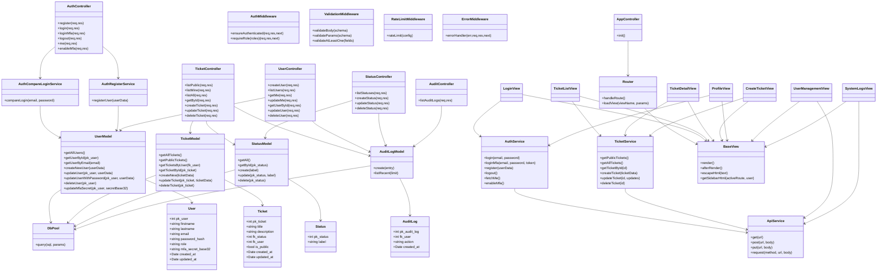

```mermaid
classDiagram
    %% === Domaine / Entites (backend) ===
    class User {
        +int pk_user
        +string firstname
        +string lastname
        +string email
        +string password_hash
        +string role
        +string mfa_secret_base32
        +Date created_at
        +Date updated_at
    }

    class Ticket {
        +int pk_ticket
        +string title
        +string description
        +int fk_status
        +int fk_user
        +bool is_public
        +Date created_at
        +Date updated_at
    }

    class Status {
        +int pk_status
        +string label
    }

    class AuditLog {
        +int pk_audit_log
        +int fk_user
        +string action
        +Date created_at
    }

    %% === Models (backend) ===
    class UserModel {
        +getAllUsers()
        +getUserById(pk_user)
        +getUserByEmail(email)
        +createNewUser(userData)
        +updateUser(pk_user, userData)
        +updateUserWithPassword(pk_user, userData)
        +deleteUser(pk_user)
        +updateMfaSecret(pk_user, secretBase32)
    }

    class TicketModel {
        +getAllTickets()
        +getPublicTickets()
        +getTicketsByUser(fk_user)
        +getTicketById(pk_ticket)
        +createNew(ticketData)
        +updateTicket(pk_ticket, ticketData)
        +deleteTicket(pk_ticket)
    }

    class StatusModel {
        +getAll()
        +getById(pk_status)
        +create(label)
        +update(pk_status, label)
        +delete(pk_status)
    }

    class AuditLogModel {
        +create(entry)
        +listRecent(limit)
    }

    class DbPool {
        +query(sql, params)
    }

    %% === Services (backend) ===
    class AuthCompareLoginService {
        +compareLogin(email, password)
    }

    class AuthRegisterService {
        +registerUser(userData)
    }

    %% === Controllers (backend) ===
    class AuthController {
        +register(req,res)
        +login(req,res)
        +loginMfa(req,res)
        +logout(req,res)
        +me(req,res)
        +enableMfa(req,res)
    }

    class TicketController {
        +listPublic(req,res)
        +listMine(req,res)
        +listAll(req,res)
        +getById(req,res)
        +createTicket(req,res)
        +updateTicket(req,res)
        +deleteTicket(req,res)
    }

    class UserController {
        +createUser(req,res)
        +listUsers(req,res)
        +getMe(req,res)
        +updateMe(req,res)
        +getUserById(req,res)
        +updateUser(req,res)
        +deleteUser(req,res)
    }

    class StatusController {
        +listStatuses(req,res)
        +createStatus(req,res)
        +updateStatus(req,res)
        +deleteStatus(req,res)
    }

    class AuditController {
        +listAuditLogs(req,res)
    }

    %% === Middlewares (backend) ===
    class AuthMiddleware {
        +ensureAuthenticated(req,res,next)
        +requireRole(roles)(req,res,next)
    }

    class ValidationMiddleware {
        +validateBody(schema)
        +validateParams(schema)
        +validateAtLeastOne(fields)
    }

    class RateLimitMiddleware {
        +rateLimit(config)
    }

    class ErrorMiddleware {
        +errorHandler(err,req,res,next)
    }

    %% === Frontend (SPA) ===
    class ApiService {
        +get(url)
        +post(url, body)
        +put(url, body)
        +request(method, url, body)
    }

    class AuthService {
        +login(email, password)
        +loginMfa(email, password, token)
        +register(userData)
        +logout()
        +fetchMe()
        +enableMfa()
    }

    class TicketService {
        +getPublicTickets()
        +getAllTickets()
        +getTicketById(id)
        +createTicket(ticketData)
        +updateTicket(id, updates)
        +deleteTicket(id)
    }

    class AppController {
        +init()
    }

    class Router {
        +handleRoute()
        +loadView(viewName, params)
    }

    class BaseView {
        +render()
        +afterRender()
        +escapeHtml(text)
        +getSidebarHtml(activeRoute, user)
    }

    class LoginView
    class TicketListView
    class TicketDetailView
    class CreateTicketView
    class ProfileView
    class UserManagementView
    class SystemLogsView

    %% === Relations backend ===
    UserModel --> DbPool
    TicketModel --> DbPool
    StatusModel --> DbPool
    AuditLogModel --> DbPool

    AuthCompareLoginService --> UserModel
    AuthRegisterService --> UserModel

    AuthController --> AuthCompareLoginService
    AuthController --> AuthRegisterService

    TicketController --> TicketModel
    TicketController --> StatusModel
    TicketController --> AuditLogModel

    UserController --> UserModel
    UserController --> AuditLogModel

    StatusController --> StatusModel
    StatusController --> AuditLogModel

    AuditController --> AuditLogModel

    UserModel --> User
    TicketModel --> Ticket
    StatusModel --> Status
    AuditLogModel --> AuditLog

    %% === Relations frontend ===
    AppController --> Router
    Router --> BaseView

    LoginView --> BaseView
    TicketListView --> BaseView
    TicketDetailView --> BaseView
    CreateTicketView --> BaseView
    ProfileView --> BaseView
    UserManagementView --> BaseView
    SystemLogsView --> BaseView

    AuthService --> ApiService
    TicketService --> ApiService

    LoginView --> AuthService
    TicketListView --> TicketService
    TicketDetailView --> TicketService
    CreateTicketView --> TicketService
    ProfileView --> AuthService
    UserManagementView --> ApiService
    SystemLogsView --> ApiService
```
