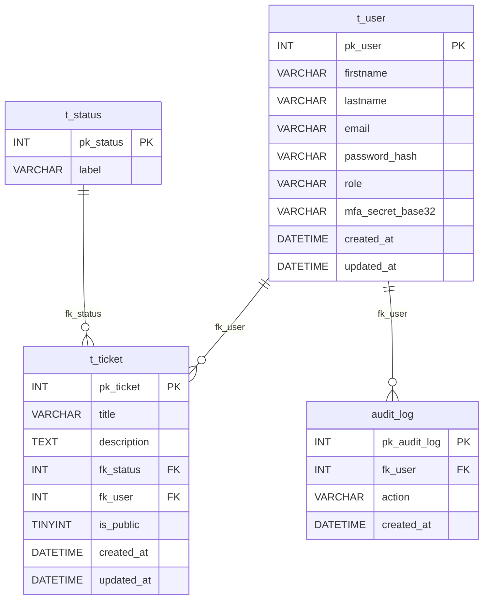
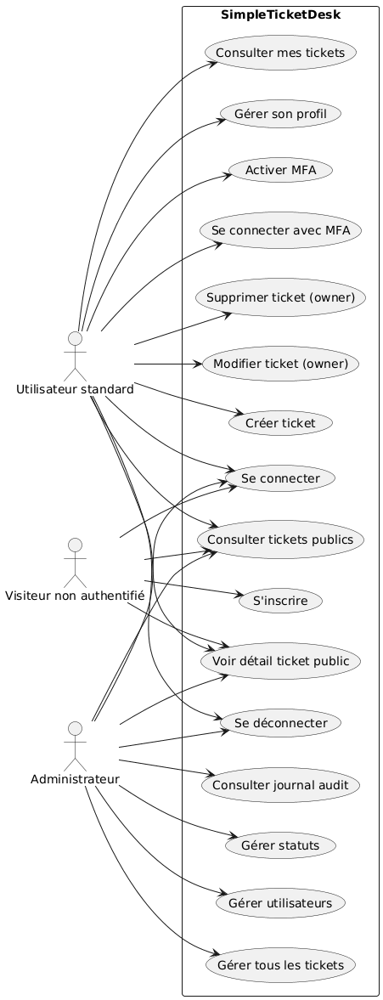
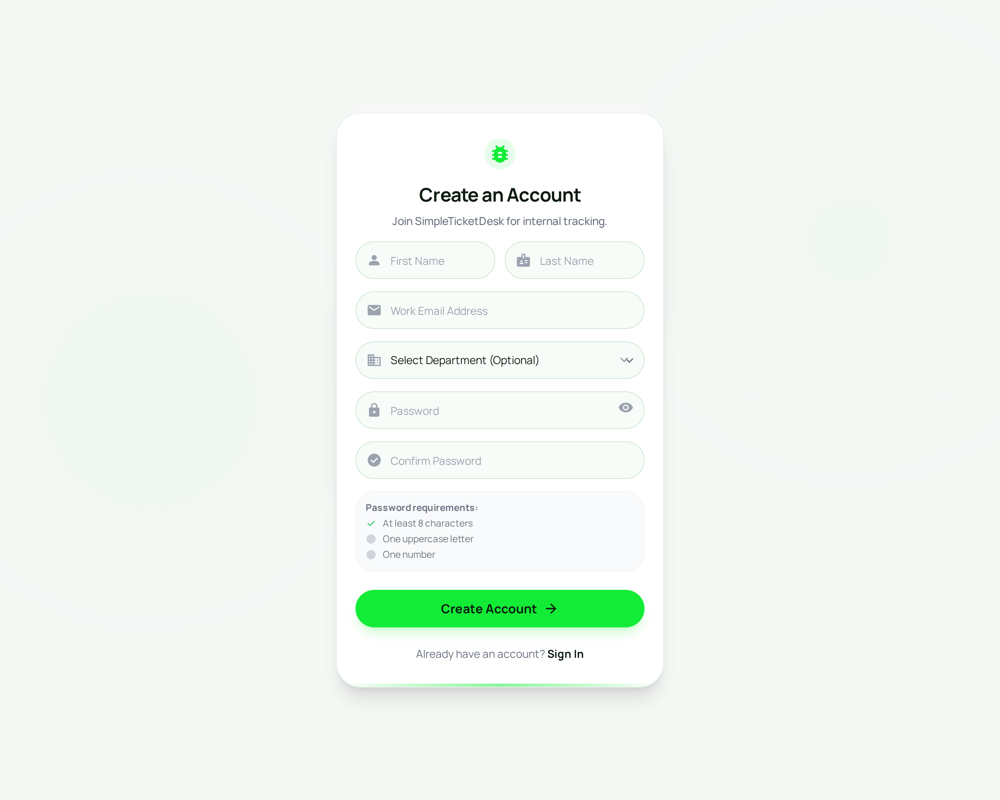
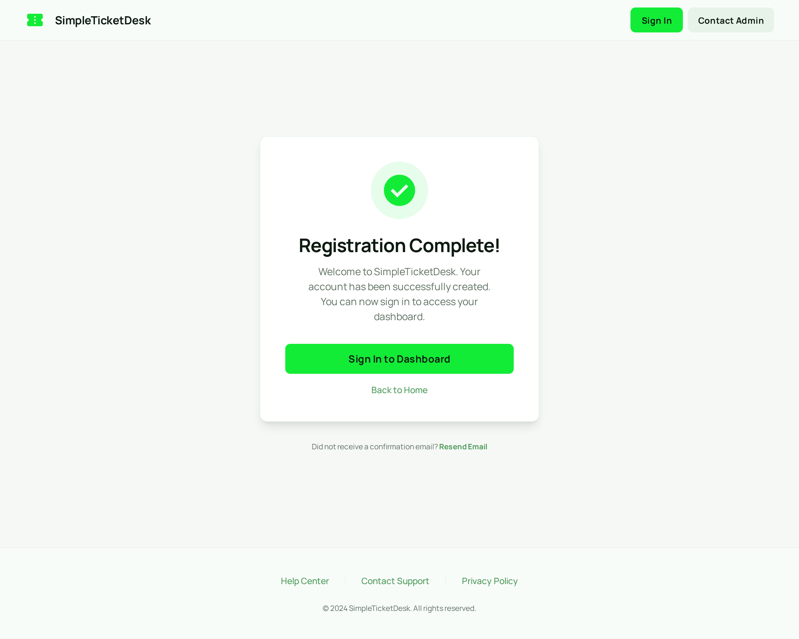
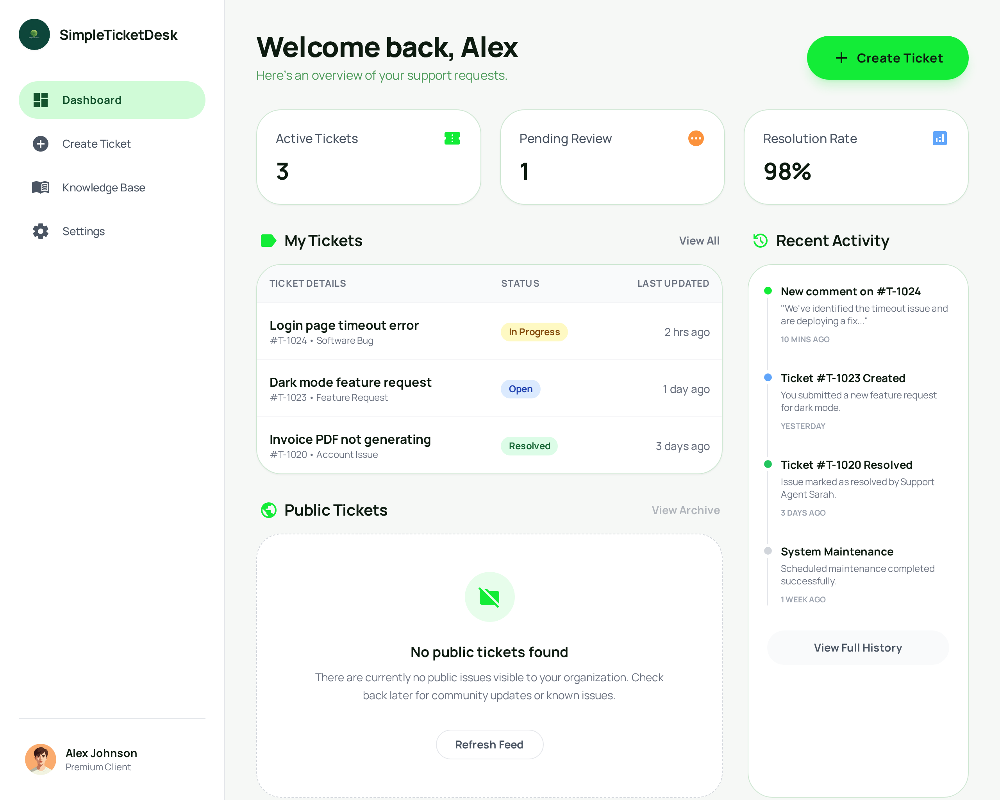
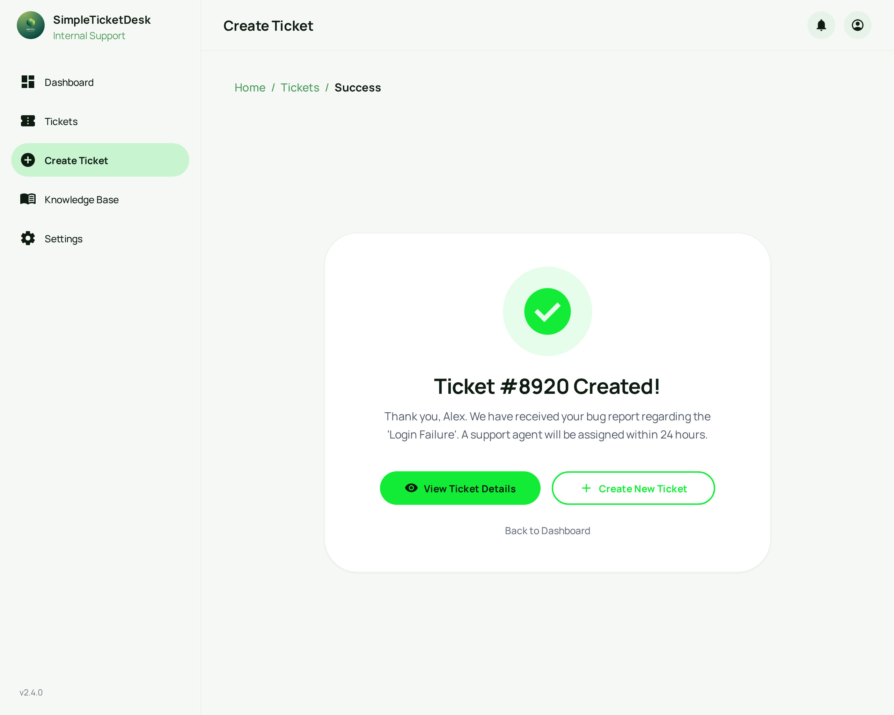
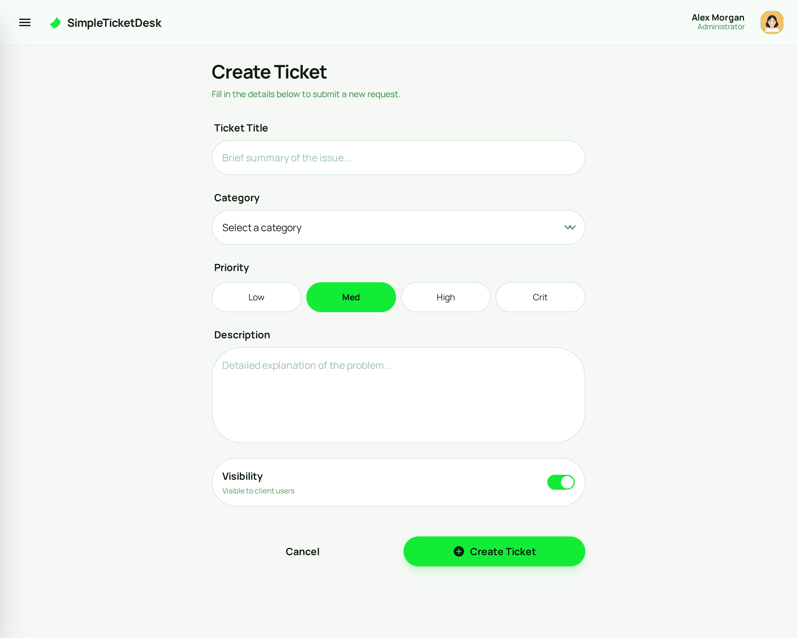
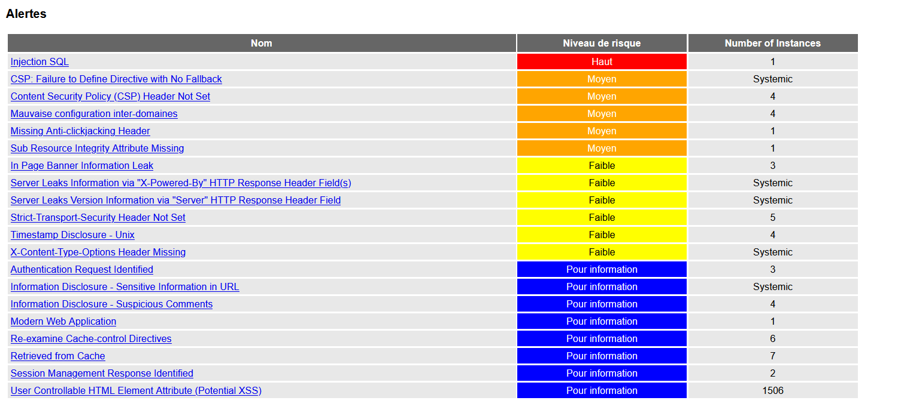

# Documentation du Projet - Module 183
## SimpleTicketDesk - Implementer la securite d'une application

Document de projet (format Markdown).
Perimetre: tickets, utilisateurs, statuts, et journal d'audit.

---

## 1. Introduction

SimpleTicketDesk est une petite application web qui met en avant les
mecanismes de securite attendus dans le module 183. L'objectif n'est pas
de produire une application riche ou complexe, mais une application
simple, lisible et clairement explicable a un enseignant. Chaque choix
technique doit rester visible dans le code, afin de montrer ou se trouve
la protection et contre quoi elle agit.

Dans ce document, je decris l'architecture, la base de donnees, les flux
principaux (auth, tickets, admin) et les mesures de securite. L'idee est
qu'une personne externe puisse comprendre rapidement le projet sans avoir
besoin de lire tout le code.

---

## 2. Architecture generale

### 2.1 Vue d'ensemble

L'application suit une architecture client-serveur classique. La partie
client est une SPA en HTML/CSS/JS qui gere la navigation et le rendu des
vues. La partie serveur est une API Node.js/Express qui applique les
regles de securite et les autorisations. La base de donnees MySQL stocke
les utilisateurs, les tickets, les statuts et l'audit. Nginx sert le
frontend statique et fait proxy vers l'API.

En pratique, le navigateur charge la SPA, la SPA appelle l'API en JSON,
et l'API repond uniquement si les conditions de securite sont remplies
(session, role, ownership, etc.).

### 2.2 Architecture cote client

Le client est organise en MVC: les controllers gerent la navigation et
les actions utilisateur, les views construisent le HTML, et les services
sont responsables des appels API. Les repertoires principaux sont
`client/js/controllers/`, `client/js/views/` et `client/js/services/`.

Le service `api.js` centralise les requetes HTTP avec `credentials: 'include'`
ce qui permet d'envoyer le cookie de session. Le fichier `baseView.js`
contient `escapeHtml`, utilise pour rendre les contenus textuels sans
introduire de HTML injecte.

Le client ne porte pas la logique de securite critique: il affiche des
boutons et fait des appels, mais c'est le serveur qui decide si l'action
est autorisee. Cela evite de confondre l'interface avec les veritables
regles d'acces.

### 2.3 Architecture cote serveur

Le serveur utilise Express en ESM. Le point d'entree installe le JSON
parser, les sessions, le logger HTTP, les routes, puis le middleware
d'erreurs. Le code est organise par responsabilites: `routes/` pour les
endpoints, `controllers/` pour la logique metier et les regles, `models/`
pour l'acces DB, et `middlewares/` pour auth, roles, validation et
rate-limit.

Un flux typique est: la route recoit la requete, applique la validation,
passe au controller, qui charge ou modifie les donnees via le model, puis
retourne une reponse propre. Cette separation rend la securite facile a
suivre et a expliquer.

### 2.4 Architecture de la base de donnees

La base est initialisee via `db/init.sql`. Elle respecte les conventions
`pk_*` et `fk_*`. Les requetes sont ecrites en SQL parametre via
`mysql2/promise`. La table `audit_log` est incluse car elle est imposee
par la partie journal d'audit du module, meme si le schema reste volontairement
minimal.

Tables (perimetre minimal):
`t_user` avec `pk_user, firstname, lastname, email, password_hash, role, mfa_secret_base32`.
`t_ticket` avec `pk_ticket, title, description, fk_status, is_public, fk_user, created_at, updated_at`.
`t_status` avec `pk_status, label`.
`audit_log` avec `pk_audit_log, fk_user (nullable), action, created_at`.

Schema ER de la base de donnees:



---

### 2.5 Diagramme de classes

```mermaid
classDiagram
    %% === Domaine / Entites (backend) ===
    class User {
        +int pk_user
        +string firstname
        +string lastname
        +string email
        +string password_hash
        +string role
        +string mfa_secret_base32
        +Date created_at
        +Date updated_at
    }

    class Ticket {
        +int pk_ticket
        +string title
        +string description
        +int fk_status
        +int fk_user
        +bool is_public
        +Date created_at
        +Date updated_at
    }

    class Status {
        +int pk_status
        +string label
    }

    class AuditLog {
        +int pk_audit_log
        +int fk_user
        +string action
        +Date created_at
    }

    %% === Models (backend) ===
    class UserModel {
        +getAllUsers()
        +getUserById(pk_user)
        +getUserByEmail(email)
        +createNewUser(userData)
        +updateUser(pk_user, userData)
        +updateUserWithPassword(pk_user, userData)
        +deleteUser(pk_user)
        +updateMfaSecret(pk_user, secretBase32)
    }

    class TicketModel {
        +getAllTickets()
        +getPublicTickets()
        +getTicketsByUser(fk_user)
        +getTicketById(pk_ticket)
        +createNew(ticketData)
        +updateTicket(pk_ticket, ticketData)
        +deleteTicket(pk_ticket)
    }

    class StatusModel {
        +getAll()
        +getById(pk_status)
        +create(label)
        +update(pk_status, label)
        +delete(pk_status)
    }

    class AuditLogModel {
        +create(entry)
        +listRecent(limit)
    }

    class DbPool {
        +query(sql, params)
    }

    %% === Services (backend) ===
    class AuthCompareLoginService {
        +compareLogin(email, password)
    }

    class AuthRegisterService {
        +registerUser(userData)
    }

    %% === Controllers (backend) ===
    class AuthController {
        +register(req,res)
        +login(req,res)
        +loginMfa(req,res)
        +logout(req,res)
        +me(req,res)
        +enableMfa(req,res)
    }

    class TicketController {
        +listPublic(req,res)
        +listMine(req,res)
        +listAll(req,res)
        +getById(req,res)
        +createTicket(req,res)
        +updateTicket(req,res)
        +deleteTicket(req,res)
    }

    class UserController {
        +createUser(req,res)
        +listUsers(req,res)
        +getMe(req,res)
        +updateMe(req,res)
        +getUserById(req,res)
        +updateUser(req,res)
        +deleteUser(req,res)
    }

    class StatusController {
        +listStatuses(req,res)
        +createStatus(req,res)
        +updateStatus(req,res)
        +deleteStatus(req,res)
    }

    class AuditController {
        +listAuditLogs(req,res)
    }

    %% === Middlewares (backend) ===
    class AuthMiddleware {
        +ensureAuthenticated(req,res,next)
        +requireRole(roles)(req,res,next)
    }

    class ValidationMiddleware {
        +validateBody(schema)
        +validateParams(schema)
        +validateAtLeastOne(fields)
    }

    class RateLimitMiddleware {
        +rateLimit(config)
    }

    class ErrorMiddleware {
        +errorHandler(err,req,res,next)
    }

    %% === Frontend (SPA) ===
    class ApiService {
        +get(url)
        +post(url, body)
        +put(url, body)
        +request(method, url, body)
    }

    class AuthService {
        +login(email, password)
        +loginMfa(email, password, token)
        +register(userData)
        +logout()
        +fetchMe()
        +enableMfa()
    }

    class TicketService {
        +getPublicTickets()
        +getAllTickets()
        +getTicketById(id)
        +createTicket(ticketData)
        +updateTicket(id, updates)
        +deleteTicket(id)
    }

    class AppController {
        +init()
    }

    class Router {
        +handleRoute()
        +loadView(viewName, params)
    }

    class BaseView {
        +render()
        +afterRender()
        +escapeHtml(text)
        +getSidebarHtml(activeRoute, user)
    }

    class LoginView
    class TicketListView
    class TicketDetailView
    class CreateTicketView
    class ProfileView
    class UserManagementView
    class SystemLogsView

    %% === Relations backend ===
    UserModel --> DbPool
    TicketModel --> DbPool
    StatusModel --> DbPool
    AuditLogModel --> DbPool

    AuthCompareLoginService --> UserModel
    AuthRegisterService --> UserModel

    AuthController --> AuthCompareLoginService
    AuthController --> AuthRegisterService

    TicketController --> TicketModel
    TicketController --> StatusModel
    TicketController --> AuditLogModel

    UserController --> UserModel
    UserController --> AuditLogModel

    StatusController --> StatusModel
    StatusController --> AuditLogModel

    AuditController --> AuditLogModel

    UserModel --> User
    TicketModel --> Ticket
    StatusModel --> Status
    AuditLogModel --> AuditLog

    %% === Relations frontend ===
    AppController --> Router
    Router --> BaseView

    LoginView --> BaseView
    TicketListView --> BaseView
    TicketDetailView --> BaseView
    CreateTicketView --> BaseView
    ProfileView --> BaseView
    UserManagementView --> BaseView
    SystemLogsView --> BaseView

    AuthService --> ApiService
    TicketService --> ApiService

    LoginView --> AuthService
    TicketListView --> TicketService
    TicketDetailView --> TicketService
    CreateTicketView --> TicketService
    ProfileView --> AuthService
    UserManagementView --> ApiService
    SystemLogsView --> ApiService
```



---

### 2.6 Diagramme de cas d'utilisation



### 2.7 Maquettes du projet








---

## 3. Gestion des utilisateurs et des roles

### 3.1 Roles implementes

Trois roles existent. Le visiteur non authentifie peut lire le public et
s'inscrire. L'utilisateur standard a le role `USER` et peut travailler sur
ses tickets. L'administrateur a le role `ADMIN` et peut tout gerer.

### 3.2 Permissions associees

Pour les tickets, un visiteur lit uniquement le public. Un `USER` peut
creer, modifier et supprimer ses tickets, et consulter ses tickets prives
ainsi que les tickets publics. Un `ADMIN` peut gerer tous les tickets.

Pour les utilisateurs, le visiteur peut s'inscrire. Un `USER` modifie son
profil via `/api/users/me`. L'admin gere tous les comptes via `/api/users`
et `/api/users/:id`.

Ces regles evitent les acces non autorises (anti-IDOR) et montrent que la
securite est imposee cote serveur, pas seulement par l'UI.

---

## 4. Authentification et autorisation

### 4.1 Processus d'inscription

L'inscription passe par `POST /api/auth/register`. Le serveur valide les
champs (format, longueur) avant toute creation, puis verifie l'unicite de
l'email. Cela evite des donnees incoherentes et reduit la surface
meditable par un attaquant.

### 4.2 Processus de connexion

Les endpoints principaux sont `POST /api/auth/login`, `POST /api/auth/login-mfa`,
`POST /api/auth/logout` et `GET /api/auth/me`. La session est geree par
`express-session` avec un cookie HttpOnly, `sameSite=Lax`, et `secure` en
production. La regeneration de session est faite au login, la destruction
au logout.

Si un utilisateur a `mfa_secret_base32`, `/api/auth/login` renvoie
`{ mfaRequired: true }` sans creer de session. La session n'est creee
qu'apres validation TOTP via `/api/auth/login-mfa`. Les erreurs renvoyees
au client restent generiques, les details vont dans les logs.

Dans l'application, chaque utilisateur peut activer la 2FA depuis les
parametres de son compte. Le serveur genere un QR code a scanner avec une
application d'authentification. J'ai teste uniquement Google Authenticator.
Une fois activee, la 2FA est demandee au prochain login via le code TOTP.

### 4.3 Hashage des mots de passe

Les mots de passe sont hashes avec `bcrypt` et stockes dans
`t_user.password_hash`. Le cout vient de `BCRYPT_ROUNDS`. Cela rend un
bruteforce offline beaucoup plus lent en cas de fuite de base.

### 4.4 Gestion de l'autorisation

Les routes sensibles sont protegees par `ensureAuthenticated` et
`requireRole`. Les regles concretes sont simples: les tickets publics sont
accessibles a tous, un ticket prive est visible par son owner ou un admin,
`PUT/DELETE /api/tickets/:id` est owner ou admin, `GET/PUT /api/users/me`
est reserve a l'utilisateur connecte, et toute gestion globale des users
ou de l'audit est admin only.

---

## 5. Securisation de l'application

### 5.1 Validation des entrees

Le serveur valide les donnees a chaque endpoint sensible. Les schemas
controlent types, longueurs et formats (email, ids numeriques, etc.). Cela
rend l'API plus robuste et limite les payloads malveillants ou incoherents.

### 5.2 Protection contre les attaques courantes

Contre l'injection SQL, toutes les requetes sont parametrees via
`mysql2/promise`, sans concatener des strings. Contre le XSS, le rendu
cote client passe par `escapeHtml` et evite `innerHTML` pour les valeurs
venant de la DB. La session est protegee par regeneration, destruction,
HttpOnly et SameSite.

Les endpoints sensibles (login, login-mfa, enable-mfa) sont limites par
`rateLimitMiddleware.js`. Le MFA TOTP utilise `speakeasy` et `qrcode`, avec
la regle critique: pas de session avant mot de passe + TOTP valides.

### 5.3 Gestion des erreurs

Les erreurs envoyees au client sont generiques pour eviter de divulguer la
structure interne. Les logs cote serveur contiennent les details utiles au
debug. Le middleware `errorMiddleware.js` centralise ce comportement.

---

## 6. Logs et audit

### 6.1 Types d'evenements enregistres

Le logger technique (Winston) enregistre chaque requete HTTP avec methode,
URL et utilisateur ou `anonymous`. Le journal d'audit (table `audit_log`)
stocke les actions sensibles comme creation, modification, suppression,
et actions admin.

### 6.2 Format et emplacement des logs

Les logs techniques sont ecrits dans `logs/access.log`. Les logs d'audit
sont en base. L'admin peut consulter l'audit via `GET /admin/audit`.

### 6.3 Relecture et exploitation des logs

Les logs servent a retrouver qui a fait quoi et quand. Ils permettent de
voir un bruteforce (multiples 401/429), de verifier une suppression de
ticket, ou de reconstituer un incident en croisant access.log et audit.

---

## 7. Tests

### 7.1 Tests fonctionnels

Le fichier `server/tests/api-test.js` couvre l'authentification, le MFA,
les roles, les tickets et l'audit. L'objectif est de verifier que les
regles d'acces et les protections fonctionnent bien.

### 7.2 Tests de securite

Une checklist manuelle permet de verifier SQLi, XSS, IDOR, sessions et
MFA. Par exemple: essayer `a' OR 1=1 --` au login (doit echouer), injecter
`<script>` dans un ticket (ne doit pas s'executer), ou tenter de modifier
un ticket d'un autre user (doit renvoyer 403).

### 7.3 Scan OWASP ZAP (avant/apres)

Comparatif visuel des alertes avant et apres corrections.

| Avant | Apres |
| --- | --- |
|  |  |

---

## 8. Deploiement

### 8.1 Preparation du serveur

Les variables d'environnement typiques sont: DB (host/user/password/name),
`SESSION_SECRET` (long et aleatoire), `NODE_ENV=production` pour activer
le cookie secure, et `BCRYPT_ROUNDS`.

### 8.2 Procedure de deploiement

Le projet se lance via Docker:
```
docker compose up -d --build
```
Apres demarrage, verifier que le client est accessible, que l'API repond,
que `db/init.sql` a bien ete applique, et que `logs/access.log` se remplit.

### 8.3 Checklist securite avant mise en production

Verifier: cookie HttpOnly + SameSite + Secure, regeneration et destruction
session, MFA sans session avant validation, rate-limit actif, validation
serveur, SQL parametre, rendu encode, erreurs generiques, audit protege.

---

## 9. Conclusion

### 9.1 Ce que j'ai appris

J'ai appris a mettre en place une authentification propre par sessions,
a gerer le MFA TOTP sans creer de session prematuree, et a appliquer des
regles d'acces cote serveur (owner/admin). J'ai aussi consolide les bases
sur SQL parametre et XSS.

### 9.2 Ce que j'ai aime

Les mecanismes sont concrets et visibles: MFA, sessions, audit, rate-limit.
On voit vite l'effet des protections, ce qui aide a expliquer le projet.

### 9.3 Ce que je n'ai pas aime

La rigueur requise (HTTPS, secrets, configuration) demande de l'attention.
Les tests de securite manuels prennent du temps si on n'a pas une
checklist claire.

### 9.4 Conclusion personnelle

SimpleTicketDesk reste minimaliste mais couvre les points attendus du
module 183: sessions, MFA, autorisations par roles et ownership, validation
serveur, protections XSS/SQLi, gestion d'erreurs, logs et audit. Le projet
reste lisible et pedagogique, ce qui est l'objectif principal du module.

---

## 10. Politique de mot de passe (rappel)

Les mots de passe sont valides uniquement s'ils respectent:
- longueur minimum: 8 caracteres
- au moins une minuscule
- au moins une majuscule
- au moins un chiffre
- au moins un caractere special

Exemple de format attendu: `MotDePasse123!`
